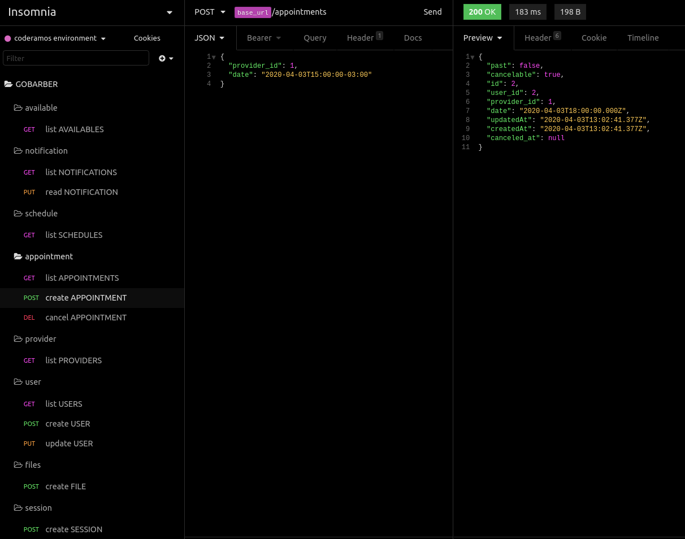

# application | GOBARBER - ENVIRONMENT

## About This Project

This project contains the API the **[application-gobarber-backend](https://github.com/coderamos/application-gobarber-backend)**.

## Prerequisites

To make the requests, you will need to install [insomnia](https://insomnia.rest/) or [postman](https://www.postman.com/) on your computer and run the **[application-gobarber-backend](https://github.com/coderamos/application-gobarber-backend)**.

The **application-gobarber-backend** project was create with [NodeJS](https://nodejs.org/en/) You can learn more in the [NodeJS Documentation](https://nodejs.org/en/docs/).

## About Me

My Github profile: https://github.com/coderamos/

My Linkedin profile: https://www.linkedin.com/in/coderamos/
